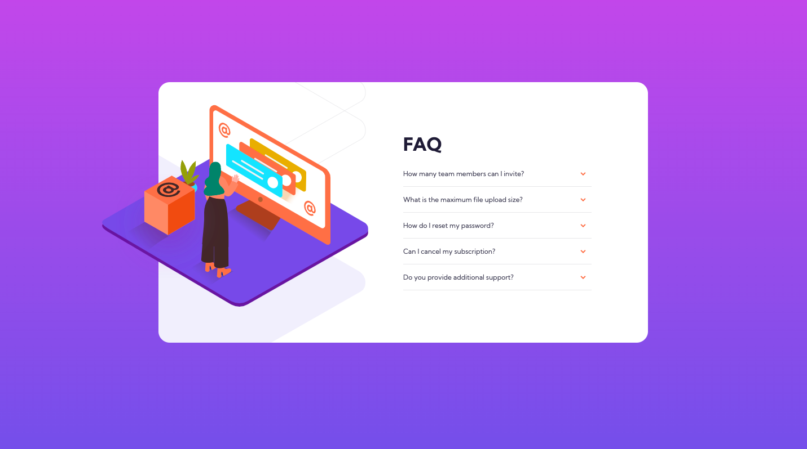

# Frontend Mentor - FAQ accordion card solution

This is a solution to the [FAQ accordion card challenge on Frontend Mentor](https://www.frontendmentor.io/challenges/faq-accordion-card-XlyjD0Oam). Frontend Mentor challenges help you improve your coding skills by building realistic projects. 

## Table of contents

- [Overview](#overview)
  - [The challenge](#the-challenge)
  - [Screenshot](#screenshot)
  - [Links](#links)
- [My process](#my-process)
  - [Built with](#built-with)
  - [What I learned](#what-i-learned)
  - [Continued development](#continued-development)
  - [Useful resources](#useful-resources)
- [Author](#author)
- [Acknowledgments](#acknowledgments)

## Overview

### The challenge

Users should be able to:

- View the optimal layout for the component depending on their device's screen size
- See hover states for all interactive elements on the page
- Hide/Show the answer to a question when the question is clicked

### Screenshot

### Links

- Solution URL:  https://samanthascarcella.github.io/FAQ-accordion-card/
- Live Site URL:  https://samanthascarcella.github.io/FAQ-accordion-card/

## My process

### Built with

- Semantic HTML5 markup
- CSS custom properties
- Flexbox
- Mobile-first workflow

### What I learned

- Accordion layout (details and summary tags) and how to modify the layout. 
- Better understanding how to use flexbox. 
- Creating parent/child relationships to layer images.

### Continued development

I would like to continue focusing on responsiveness and making specific classes to use among multiple elements (e.g., is-mobile-view, is-desktop-view). 

I want to continue doing projects to expose me to different techinques and requirements. 

### Useful resources

- Codepen was useful to help me understand how to customiz an accordion. Multiple examples were reviewed and tailored to make this accordion. 

## Author

- Website - [Samantha Scarcella](https://www.your-site.com)
- Frontend Mentor - [@samanthascarcella](https://www.frontendmentor.io/profile/yourusername)

## Acknowledgments

I would like to acknowledge the Frontend Mentor and Codepen communities for creating opportunities for other developers learn and grow. 
